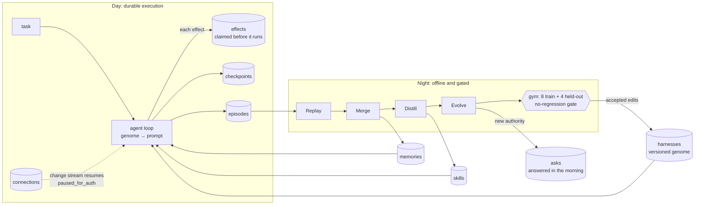

# Offload

**An agent harness that sleeps, and wakes up with a better harness.**

Offload learns the work you repeat, so next time you can hand it over. Its engine, **REM** (Replay · Evolve · Merge),
runs the harness on a day/night cycle:

- **Day.** The agent works long-horizon tasks through connected accounts, durably. Every step writes a checkpoint. Every
  side effect is claimed in an effects ledger before it runs. Recovery is verified against the persisted fixture provider;
  real external services still require their own idempotency and reconciliation contract.
- **Night.** It replays the day, merges duplicate memories and archives omitted raw evidence, distills repeated work into a tested skill,
  and evolves its own harness (rules, guardrails, tool scopes, context policy, model routing) against a gym with a
  held-out split. Every edit carries a falsifiable prediction, and a no-regression gate decides what ships.
- **Morning.** It asks once for any new authority it wants, such as letting a skill that sends email run on its own,
  then runs the same task again, measurably better.

Built for the MongoDB × Cerebral Valley **Harness Engineering & Model Wrangling** hackathon (NYC, September 26, 2026) for
both problem statements: recursive harnessing (the harness edits its own rules, guardrails, tool access and routing) and
long-horizon engineering (durable execution, plus memory that gets smaller and more precise as it grows, judged by hard
metrics).

## Matched SDK comparisons (September 26, 2026)

The homepage now shows two flat graphs using the site fonts and neutral palette. Every bar links to reproducible receipts through one methods report. These compare a configured OpenAI Agents SDK reference with Offload's context selection, using identical models, task inputs, tools and budgets within each pair.

| Model | Paired runs | SDK tokens | Offload all-in tokens | Exact checks, SDK / Offload |
| --- | ---: | ---: | ---: | --- |
| GPT-4o-mini | 3 | 111,118 | 100,377 (9.7% fewer) | 35/36 / 36/36 |
| GPT-6 Astra | 2 | 53,388 | 61,790 (15.7% more) | 24/24 / 24/24 |
| Claude Opus 5.5 | 2 | 135,119 | 119,710 (11.4% fewer) | 24/24 / 23/24 |

Each run contains the same three synthetic tasks and twelve chronological stages. Opus's missed check was extra prose after otherwise correct JSON; GPT-4o-mini's reference missed a schema check. These are exact task/format checks, not general reasoning scores. Selector and retrieval overhead count. Offload took longer and made more calls. All-in cost is unknown where TypeSafe omitted prices. Three additional infrastructure-failed frontier attempts preserve all 25 rate-limit responses and known charges. The two paced replacements per frontier model were fixed before execution; no outcome-based stopping or prompt tuning occurred.

Astra uses a verified Responses tool adapter in both arms. Opus and GPT-4o-mini use the matched Chat Completions protocol. This does not benchmark the complete Codex or Claude Code products. [All trials](docs/evidence/reference-summary.json), [methods](scripts/agents-reference/README.md), and [public report](public/evidence/benchmark-report.html).

The app now groups REM and Memory under Sleep, preserves old URLs, and keeps live execution separate from the static hosted preview. A completed local chat job is acknowledged only after its final checkpoint write finishes.

## Sleep: measured context compaction (September 26, 2026)

Sleep now selects useful tool history with **Jev probabilities**, archives omitted records in **MongoDB**, and recovers
original evidence by run-scoped id. It preserves complete tool exchanges and detected constraints, reuses decisions
when the task state is unchanged, and removes identical read-only results without a model call. This is integrated
before planner/executor calls in the REM runtime and displayed under **Sleep > Memory > Context memory**.

**Earlier same-harness development result: 17.69% fewer total tokens on evolving tasks, including Jev and recovery.**
Full context uses 39,196 tokens; Offload uses 32,264. Offload passes 12/12 exact JSON checks, versus 11/12 for full
context. The baseline failure is an extra `reason` field in an otherwise correct answer. The same GPT-4o-mini model,
three synthetic tasks and twelve chronological stages are used on both paths. These inputs were used during
optimization, so this is a development benchmark, not an untouched evaluation or a general intelligence claim.

| Live workload and policy | Full context | Offload, including Jev | Exact checks, baseline / Offload |
| --- | ---: | ---: | --- |
| Evolving, original causal policy | 43,623 | 69,384, 59.05% more | 11/12 / 11/12 |
| Evolving, shortened prompt | 43,606 | 56,664, 29.95% more | 11/12 / 11/12 |
| Evolving, lossless v4 | 43,627 | 46,610, 6.84% more | 11/12 / 11/12 |
| Evolving, evidence policy plus v5 | 34,910 | 36,238, 3.80% more | 12/12 / 12/12 |
| Evolving, evidence policy plus v9 | 39,196 | 32,264, 17.69% fewer | 11/12 / 12/12 |
| Stable snapshots, five calls each, v9 | 26,640 | 9,052, 66.02% fewer | 20/20 / 20/20 |

V9 factors exact repeated text, shares the encoding schema and retention rubric, and batches decisions while keeping
original source identities, order, whitespace and multiplicity. New evidence still invalidates scores. It also keeps
explicit retention questions: shorter experimental prompts failed live selection and were rejected. Their paid tokens
remain in the evidence. This is measured optimization, not removal of safeguards or a changed answer checker.

The evolving total comprises 12,011 answer-model tokens and 20,253 Jev tokens; archive recovery passes 1/1 and
restarted selections make zero new scoring calls. Answer-model tool choices vary between runs even with temperature
zero, so changes in paired baselines are visible above. Direct TypeSafe did not return prices; combined evolving
monetary savings are unknown. The repeated workload contains four snapshots answered five times per path, with 2,435
answer tokens and 6,617 scoring tokens. Its reported OpenRouter spend is $0.000714378 versus $0.0023805. Neither test
establishes universal savings, calibrated probabilities, or billion-token performance.

[Latest evolving receipt](docs/evidence/jev-context-evolving-combined-v9.json),
[latest repeated receipt](docs/evidence/jev-context-repeated-schema-v9.json),
[all versions and adverse results](docs/context-evolving-evidence.md), and
[research and configuration](docs/sleep-context-compaction.md).

### Personal histories: artifact generation improved, task quality still incomplete

Frozen replay tasks use authorized pre-cutoff Codex and Claude messages, actual Sleep file execution and independent
criteria hidden from the models. The original research attempt produced no artifacts on either path after 18 calls
and 105,645 tokens. A strict output-format clarification now produces each artifact in one call. However, three
GPT-4o-mini trials per path still yield **0/3 fully passing research artifacts and 0/3 onboarding artifacts**. Research
scores 63/93 versus 64/93 criteria; onboarding 19/36 versus 18/36. All twelve files are hash-verified, but valid files
are not equivalent to completed tasks.

These smaller histories fit under the compaction threshold. Paired provider request hashes are identical and Jev
makes zero calls, so their small token differences are generation variation, not compaction benefits. Those twelve
calls consume 67,927 tokens, additional to the failed original batch and a 5,868-token diagnostic. All are retained.
The full 145-message onboarding variant naturally reaches 67,208 serialized characters. Its original protection
policy keeps 31,287, exceeding the 16,000-character budget before scoring. The harness now detects that impossible
floor before spending any Jev calls, while preserving the exact archived source. No successful full-history result
is claimed from this admission check. [Conditions, failures and receipts](docs/personal-session-evidence.md).

A later one-pair development pilot jointly changes the task contract and answer model to production Sleep's
GPT-4.1-mini. Research improves to **29/31 on both paths**, onboarding to **10/12 versus 9/12**. Neither fully passes.
The complete personal experiment ledger is **43 calls, 258,093 tokens and $0.0435863**, including every failed attempt.
These are measured quality improvements under a joint configuration change, not isolated prompt effects or compaction
savings. [Raw ledger](docs/evidence/personal-replay-experiment-ledger.json).

### Bounded memory and actual restart recovery

REM now stores canonical exchanges in indexed MongoDB event/part documents and keeps only a bounded working transcript
in each checkpoint. Source selection never deletes the originals. Changed goals reconsider bounded archive pages;
new observations invalidate stale decisions, and the model can explicitly recover older parts. Guard proofs survive
omission. Uncertain or protected context that cannot fit pauses for review.

| Check | Before or comparison | Current observed result | Boundary |
| --- | --- | --- | --- |
| 300-step checkpoint | Reconstructed full-history checkpoint: 1,245,224 bytes | Maximum working checkpoint: 18,852 bytes, 98.49% smaller | Deterministic fixture, not tokens |
| Tool-message replay | Reconstructed full-history replay: 191,814,470 bytes | 2,832,660 bytes, 98.52% less | Same 300-step fixture; 179 scripted decision calls counted separately |
| Restart and exact source recovery | Full canonical history: 1,242,822 bytes | All 300 steps retained; old source recovered after new worker | No billion-token claim |
| Stale Mongo workers | Three reproduced overwrite races | All three rejected after fencing fixes | Local MongoDB 8.2.6 replica set |
| Actual process termination | SIGKILL after simulated send, before ledger commit | Fresh process: exactly one send, one provider receipt, reconciled ledger | Real processes and MongoDB; fixture provider, no real email |

[Transcript evidence and limitations](docs/sleep-transcript-storage.md),
[real Mongo race evidence](docs/evidence/rem-transcript-mongo.json), and
[process-recovery contract](docs/completion-contract.md).

Completion requires valid evidence. Missing checks, failed checks, invalid probabilities and a configured Jev outage
cannot become verified completion. Permission expansions are validated against train, held-out and adversarial cases,
then promoted transactionally. The shared REM demo API remains local and is disabled in production.

Enable with `REM_COMPACTION=jev`, a private Jev API key, and the intended Atlas environment. Run
`npm run context:benchmark` for labeled deterministic fixtures, or the documented `--live --atlas` commands for paid
live measurements. The implementation adapts state-aware compression principles from
[StateComp (September 2026)](https://arxiv.org/abs/2609.27298) and reversible, just-in-time memory ideas from
[Anthropic (September 2025)](https://www.anthropic.com/engineering/effective-context-engineering-for-ai-agents).

### Native OpenRouter context selection

The actual OpenRouter tool loop now accepts the same selector with `OFFLOAD_COMPACTION=jev` and MongoDB configured.
User instructions, tool/result pairs, file effects, denied permissions, errors and archive reads stay protected.
Decision usage is included in the task total, including a failed selection; unknown provider usage remains marked unknown.
An over-budget protected context stops before the next answer-model request. This opt-in adapter bounds selected tool history during a 40-step turn; initial instructions and images remain intact outside that budget; it does not implement native cross-turn recovery or replace Codex's context system.

A paired scripted-provider test uses real local file tools and seven reads. Both paths recover the exact original key
(1/1 each). Cumulative serialized model prompts fall from **116,021 to 49,891 characters (57.00%)**, including one extra
archive-recovery call. Model requests rise from **8 to 9**, and selection uses **15 scripted decision calls**. These are
measured prompt characters and a correctness test, not paid-model token savings. Native-context tests cover recovery, protocol, owner isolation, protected denials, images and provider-call prevention after overflow. Cancellation preserves 105 already-reported fixture tokens; a malformed paid reply preserves its 130 reported tokens instead of recording zero; duplicate tool IDs execute zero tools.
Run `node scripts/benchmark-native-context.mjs docs/evidence/native-context-current.json`.
[Raw paired evidence](docs/evidence/native-context-current.json) and [integration details](docs/native-context.md).

### Source-backed next actions

Next actions learns a repeated context-recovery habit from explicitly selected history. Reopening a project can propose
one supported task. Accepting it runs four durable checkpoints, produces a source-checked Markdown artifact, and records
feedback for a versioned policy change. Importing history alone cannot start work. No private history is imported automatically. Imported notes use configured MongoDB storage; remote model scoring
requires explicit configuration. A five-read Atlas measurement beside 10,000 unrelated records reduced median
read latency from 1,474 ms to 436 ms while examining three source documents; this is a small retrieval measurement,
not a long-term usefulness score. [Behavior, tests and reproduction](docs/personal-suggestions.md).

## See the cycle in one minute

Requires Node 22.12+ or 24.

```sh
npm ci
npm run rem:demo
```

This runs day one, the night, the morning and five simulated days in about a second, and rewrites
[docs/DEMO-NUMBERS.md](docs/DEMO-NUMBERS.md). The run is deterministic and ignores `.env`: an in-memory MongoDB
stand-in, a scripted model, a fixture Google workspace and a simulated reviewer (see [What is real](#what-is-real)).
Numbers from the current run:

| Metric | Day 1 | Day 5 |
| --- | --- | --- |
| Tasks passed | 2/4 | 4/4 |
| Collateral damage | 3 | 0 |
| Estimated cost for the day | $0.0861 | $0.0069 |
| Human interventions (corrections and reconnects) | 4 | 0 |
| Memories with sleep (raw items without) | 15 (30) | 32 (118) |
| Retrieval precision@k with sleep (without) | 1 (0.9) | 1 (0.4) |

Day one revokes the Drive token mid-run; days 2 to 5 inject a crash after the send instead. Costs count tokens as
characters/4 at placeholder prices.

- **Durability.** Day one's Drive token is revoked after step 3. The run parks as `paused_for_auth`, asks once, and a
  change stream on `connections` resumes it from its checkpoint after the reconnect. Over five days, 10 effects
  committed, 10 executed and 0 duplicated, and all 4 injected crashes were reconciled from the ledger.
- **Evolution.** Night one accepted two edits (a "never include customer names" rule and an internal-recipients-only
  guardrail) and rejected routing every executor call to the small model: it cut cost 82% but broke held-out task H2.
  The held-out split went from 1/4 at gen 0 to 3/4 after night one and 4/4 after night two. Train went from 3/8 to 8/8
  by harness v4. The proposer never sees held-out tasks; the gate does, so the split works as a validation set.
- **Morning.** Approving the ask ("Want me to send the brief myself next time?") makes the distilled weekly-brief skill
  autonomous. The same brief then takes 6 steps instead of 9 and $0.0321 instead of $0.0424, with no corrections. Day
  one's run also included the revoke and reconnect.

## How it works



**Day** (`rem/agent.js`, `rem/ledger.js`). The harness is data: a versioned genome of rules, guardrails, tool scopes, a
context policy and model routing. The agent builds its prompt from the genome plus retrieved memories and skills.
Guardrails are declarative predicates checked before every tool call. Each effect gets a key,
`sha256(runId, step, tool and arguments)`, inserted as `pending` under a unique index before the effect runs. A retry
that hits the key either returns the committed result or reconciles against the world without re-executing. The ledger
commit and the checkpoint update share one transaction. If the harness changed overnight, a resumed run re-plans its
remaining steps under the new version and keeps its committed effects.

**Night** (`rem/night.js`, `rem/evolve.js`, `rem/proposer.js`).
**Replay** re-reads the day's episodes.
**Merge** folds duplicate facts into memories with provenance, resolves contradictions by recency and confidence, drops
noise and sets consolidated episodes to expire through a TTL index.
**Distill** mines repeated tool-call sequences from runs and demonstrations into a parameterized skill and practices it
in a sandbox.
**Evolve** mines failure patterns on the train set, skips edits it has already tried, proposes up to three bounded
edits with predictions, validates each on train plus held-out, and commits only net-positive edits that break no
passing task. Prediction versus outcome is aggregated by edit type into a track record that calibrates the next
night's proposals. The proposer never sees held-out tasks, and the gym's fixtures and checkers are frozen.

**Morning** (`rem/asks.js`). Anything that needs new authority becomes an ask instead of passing the gate: a skill that
sends or deletes, a new tool scope, a loosened guardrail. Decisions are stored and shape later asks. After one read-only
approval, read-only skills are approved automatically; sends always ask.

The full design is in [docs/rem-engine.md](docs/rem-engine.md). The vocabulary is in [CONTEXT.md](CONTEXT.md).

## Computer history

Offload learns the work you repeat from which app, window and page you are on, the way you would describe your day,
not by recording your screen. It lives at **Computer history** in the app (`/app/history`).

- **Capture** (`npm run activity:collector`, macOS). Every 5 seconds: the frontmost app (`lsappinfo`), its window
  title (System Events, which needs Accessibility access), the browser's page (AppleScript, which needs Automation
  access), and whether you have been idle for 2 minutes (`ioreg`). No screenshots, no keystrokes, no page contents.
  Emails, long numbers, query strings and URL fragments are removed before anything is stored. Excluded apps
  (1Password, Keychain Access, System Settings and others you add) and private browser windows are kept as "private"
  time with no details. Pausing in the app reaches the collector through a change stream.
- **Sessions.** Raw samples go to `activity_events`, a time-series collection that deletes them after 7 days. One
  aggregation folds them into `activity_sessions`: `$setWindowFields` finds where the app, window or page changes, a
  running `$sum` numbers the sessions, `$group` builds them and `$merge` upserts them. Session ids are the device plus
  the start time, so rerunning the pipeline extends the open session instead of duplicating it.
- **Search.** Each session is embedded (Voyage `voyage-4` when `VOYAGE_API_KEY` is set, a local hashing embedder
  otherwise) and indexed by Atlas Vector Search and Atlas Search. One `$rankFusion` query fuses the two, so "when did
  I work on the weekly brief" finds the document by its words and by meaning. Visits to the same window on several days
  come back as one result. Without Atlas Search the same fusion runs in the app.
- **Routines.** A second aggregation splits each day into stretches at breaks (idle time or a gap over 5 minutes),
  keeps stretches of 2 to 6 steps that take under an hour, and groups identical stretches across days (`$group` on the
  step array, `$median` for the usual time). One that recurs on 3 days, or 4 times, becomes a routine in
  `activity_routines`, which the page offers to hand off. `$merge` keeps each routine's decision across reruns.
- **Live.** A change stream on `activity_sessions` feeds the page over Server-Sent Events.

Routines need several days of history, so `npm run activity:seed` adds a sample work week (the five weekdays before
today) on a device called `sample-week`. Every seeded sample is stored with `source: "seed"`, and the app labels it as
sample data. From that week the miner finds two routines: Gmail → Google Docs ("Weekly brief") → Slack around 9 AM,
and Linear → Slack → Gmail around 5 PM.

History is keyed by this computer's user name (`ACTIVITY_WORKSPACE` overrides it) and device. The team shares one
cluster, so anyone with database access can read it; a real deployment would give each person their own database
user and database.

| Route | Does |
| --- | --- |
| `GET /api/activity/status` | whether MongoDB is configured, search mode, embedder, devices |
| `GET /api/activity/timeline?day=` | the day's sessions |
| `GET /api/activity/stats?day=` | active time, time per app and hour, focus blocks, app switches |
| `GET /api/activity/search?q=` | hybrid search over sessions |
| `GET /api/activity/routines`, `POST /api/activity/routines/:id` | routines, and approve or dismiss one |
| `GET`/`POST /api/activity/settings` | pause, excluded apps, capture of titles and page addresses |
| `POST /api/activity/forget` | delete samples and sessions in a time range |
| `GET /api/activity/stream` | Server-Sent Events from change streams |

## MongoDB

| Collection | Holds | MongoDB feature |
| --- | --- | --- |
| `effects` | effects ledger | unique `effectKey`: a retry hits error 11000 instead of a second send |
| `checkpoints` | per-run state | unique `runId`, one transaction with `effects` |
| `connections` | token state, granted scopes | change stream resumes paused runs |
| `episodes` | raw tool calls, observations, corrections, demonstrations | TTL on `expireAt` (forgetting); vector and text search on `summary` |
| `memories` | consolidated facts with provenance and contradiction links | vector + text, fused with `$rankFusion` or in the app |
| `skills` | procedures with a test, required scopes and approval status | unique `name`; vector + text |
| `harnesses` | immutable genome versions with parent, diff and fitness | lineage |
| `edits` | proposals, predictions, outcomes | hybrid search over past edits; the track record is an aggregation |
| `asks` | permission requests and decisions | unique `dedupeKey`, so a run asks once |
| `metrics` | per-day metrics | time-series collection |

`rem/db/schema.js` defines the indexes and the Atlas Vector Search and Atlas Search definitions (`autoEmbed` with
voyage-4). Change streams also feed `GET /api/rem/stream` over Server-Sent Events.

One more MongoDB-backed service lives under `server/`:

- **Durable harness** (`server/harness/`): a job queue with idempotent enqueue, atomic claims, renewable leases and
  fencing tokens, so a stale worker can't overwrite a newer one. Each run saves four checkpoints and receipts. It
  produces internal artifacts only; it sends nothing external.

An earlier Sleep v2 service was folded into REM, the single Sleep engine (see [docs/rem-engine.md](docs/rem-engine.md),
"One Sleep"), and removed.

## What is real

REM runs end to end without credentials, and the test suite covers REM, the durable harness and computer history without them.
Environment variables switch on the external services:

| Piece | Without credentials | With `.env` |
| --- | --- | --- |
| REM database | in-memory store with the Node driver's call shapes: unique indexes, TTL sweep, change streams, transactions | `MONGODB_URI` (Atlas Sandbox), optional `REM_DB_NAME` (default `rem`); gym and practice runs still use in-memory scratch databases |
| REM model | `ScriptedModel`: deterministic, follows the rules, guardrails, memories and skills in its prompt | `REM_MODEL=openrouter`, `OPENROUTER_API_KEY` |
| REM embeddings and search | local hashing embedder; app-side BM25 and cosine fused by reciprocal rank | on Atlas: `autoEmbed` (voyage-4) vector indexes and Atlas Search, fused with `$rankFusion` by default (`REM_ATLAS_SEARCH=0` turns it off); `REM_VECTOR_MODE=explicit` for clusters without autoEmbed |
| REM proposer | a fixed catalog of 12 bounded edits, with predictions calibrated by the track record | an LLM proposer exists in `rem/proposer.js` but is not wired to an env switch |
| REM consolidator | a deterministic fact extractor over the fixture notes | not yet model-backed |
| Accounts and reviewer | a fixture Drive, Gmail and Calendar workspace with a deterministic revoke; day-one corrections come from the gym's checkers | no real OAuth yet |
| Durable harness | integration tests against a disposable local `mongod` | `MONGODB_URI`, `OPENROUTER_API_KEY`, `OFFLOAD_MODEL` |
| Computer history | integration tests against a local `mongod`, with the fusion computed in the app | `MONGODB_URI`; Atlas Search, Vector Search and `$rankFusion` verified on the event cluster (MongoDB 8.0); `VOYAGE_API_KEY` for semantic embeddings |
| REM tracing | nothing: every trace call in `rem/trace.js` is a plain pass-through, no LangSmith call is made | `LANGSMITH_API_KEY` traces day runs, planning, recall, tool calls, effects, the completion gate, model calls and night phases as nested LangSmith runs; `npm run rem:langsmith` also runs the gym as two comparable LangSmith experiments |

Limits, stated plainly:

- The numbers above come from the scripted model, which responds to the catalog's rules by design, so the improvements
  are expected rather than discovered. The loop around it (mining, predictions, validation, the gate, the ledger) is
  real code. Running a real model through OpenRouter is what tests whether the edits help.
- REM is verified on the Atlas Sandbox (MongoDB 8.0.32): all 8 `autoEmbed` indexes reach READY and hybrid recall runs
  as `$rankFusion`. `node --env-file=.env scripts/rem-demo.mjs --atlas` runs the five-day story in the `rem_demo`
  database and writes [docs/DEMO-NUMBERS-ATLAS.md](docs/DEMO-NUMBERS-ATLAS.md); plain `npm run rem:demo` still runs in
  memory. OpenRouter is used for the completion check when `REM_COMPLETION=jev`; the day agent stays scripted unless
  `REM_MODEL=openrouter`.
- REM has its own page in the app (**REM**, `/app/rem`), showing the day, night and morning from the live API.
- Suggestions, routines and the sample account in the Offload workspace still come from the deterministic engine in
  `shared/workspace.js`. Workspaces live in browser storage by default; with `VITE_STORAGE_MODE=api` and `MONGODB_URI`,
  the local API keeps them in Atlas (`offload.workspaces`). Chat runs on Codex or OpenRouter with local tools.

## Run the app

```sh
npm run dev      # web on http://127.0.0.1:5193, API on 5194
```

`npm run dev` reads the local `.env` for the API. Existing browser workspaces stay local unless `VITE_STORAGE_MODE=api` is selected. For
the MongoDB-backed services, copy `.env.example` to `.env`, fill in the event Atlas Sandbox connection string and keys,
then:

```sh
npm run build
npm run harness:server   # site and API on http://127.0.0.1:5194
npm run harness:worker   # second terminal
npm run activity:collector   # computer history; add -- --dry-run to print samples without storing them
npm run activity:seed        # optional: the labeled sample week, so routines show up
```

Open http://127.0.0.1:5194/app/rem for REM and http://127.0.0.1:5194/app/history for computer history. The durable
handoff page still works at http://127.0.0.1:5194/app/harness, but it is no longer in the navigation.

### REM API

| Route | Does |
| --- | --- |
| `GET /api/rem/state` | harness and lineage, edits, metrics, open asks, memory stats, skills, runs, effects ledger, latest brief |
| `POST /api/rem/run` | run a task (`{ taskId, week? }`) |
| `POST /api/rem/connection` | expire or restore a connection (`{ provider, state }`); restoring resumes paused runs |
| `POST /api/rem/sleep` | run one night and return the morning brief |
| `POST /api/rem/asks/:id` | approve or deny an ask |
| `POST /api/rem/simulate` | run simulated days (`{ days }`) |
| `POST /api/rem/reset` | start a fresh instance; on Atlas this drops the REM database |
| `GET /api/rem/stream` | Server-Sent Events from change streams |

The API is one shared local demo instance. Every REM route checks the loopback peer, Host and Origin; mutations
require the local client header. Production mode disables the shared API. These checks are not multi-user authentication.

### ChatGPT on this Mac

Run `npm run dev`, open Connections, and choose **Use ChatGPT**. Offload reuses the Codex CLI sign-in on this computer. If needed, run `codex login` in Terminal first. Credentials stay in Codex. Set `OFFLOAD_CODEX_BIN` when the executable is elsewhere.

The composer lists models from Codex's `model/list`. GPT-5.5 has completed a live check on this machine. Other listed models can still be unavailable at execution time. Failed requests show an error and keep the conversation.

Chat uses the original Beautiful UI Prompt Bar, Streaming Text, Loading State and Context Cards. The sidebar uses its published Sidebar Nav. Offload sends its identity, up to four relevant notes of 360 characters each, and at most five earlier messages. Retrieval uses keyword matches with a small preference for saved rules. There is no embedding service. Codex adds its own system context, which appears in the token receipt.

The local bridge accepts loopback app origins and requires the app request header. Foreground Codex tasks use scoped working folders and per-turn approvals. Opt-in idle Sleep uses the bounded local draft executor described below. The bridge is disabled in production and is not public authentication.

Overnight tasks execute through the connected Sleep worker with a deadline, token budget, output permissions and acceptance checks. Native OpenRouter context selection is opt-in and documented above. Codex manages its own context.

### Appearance and reasoning

Settings ends with 17 palettes, including monochrome, Codex-style light/dark, Claude-style light/dark and common editor palettes. System matching is available for the Codex and Claude families. Paste a `codex-theme-v1` export to import any other Codex palette. These are Offload adaptations, not a claim that every editor palette ships with the Codex desktop app. Fonts and layout stay consistent while the colors change.

The composer has Light, Medium, High, Extra high, Max and Ultra reasoning options. Levels not advertised for the selected model are disabled. The selected supported level is sent to Codex. Reduced-motion preferences remove the sliding animation.

## Tests

```sh
npm test          # unit and integration tests
npm run test:e2e  # Playwright in Google Chrome, desktop and mobile; start npm run dev first
npm run build
```

`npm test` covers REM durability under seeded chaos (40 seeds × 4 tasks, crashes before and after each effect and
inside the commit, plus random auth expiries: every effect runs exactly once and every task finishes), the gym's
read-only boundary, the no-regression gate, Merge and Distill, asks and risk tolerance, the durable harness against a
disposable local `mongod` (concurrent claims, stale-worker fencing, crash recovery), and computer history on the same `mongod` (redaction and private windows, sessions from one
aggregation, routines, search, forgetting, the API).

## Desktop and deployment

```sh
npm run desktop:setup
npm run desktop
npm run desktop:package
```

The Electron wrapper disables Node integration and remote pages, and enables context isolation and the sandbox.
Packaging is unsigned. `npm run build` produces `dist/`, which deploys to Vercel as a static site with `vercel.json`;
keep `VITE_STORAGE_MODE=browser` for a public demo, since the static site does not include the API.

## Layout

| Path | What |
| --- | --- |
| `rem/` | REM engine: day loop, ledger, night, evolution, gym, asks, database adapters |
| `rem/trace.js` | optional LangSmith tracing (`traceable`, `annotate`, `traceModel`); a no-op without `LANGSMITH_API_KEY` |
| `server/index.js` | Express API: workspace, durable harness, computer history and REM (`server/rem.js`) |
| `server/harness/` | durable harness (its `connectStore()` is the server's MongoDB connection) |
| `server/activity/` | computer history: macOS capture, collector, sessions, search, routines, sample week |
| `src/` | React 19 + Vite app and landing site |
| `shared/workspace.js` | the mock engine behind the Offload workspace |
| `scripts/rem-demo.mjs` | the terminal demo |
| `scripts/rem-langsmith.mjs` | `npm run rem:langsmith`: uploads the gym as a LangSmith dataset and runs two genomes as two LangSmith experiments |
| `desktop/` | Electron wrapper |
| `.mcp.json`, `scripts/mongodb-mcp.mjs` | a MongoDB MCP server for Claude Code sessions, read-only on the same `MONGODB_URI` |
| `tests/` | `node:test` suites and Playwright specs |
| `docs/` | concept, engine design, demo numbers, build plan |

More: [docs/03-rem-concept.md](docs/03-rem-concept.md) (the concept),
[docs/rem-engine.md](docs/rem-engine.md) (the engine),
[THIRD_PARTY.md](THIRD_PARTY.md) (component provenance and licenses).

## Prior art

REM stands on Letta's sleep-time compute (agents reorganize memory while idle), Self-Harness and Agentic Harness
Engineering (weakness mining, proposals with predictions, held-out validation), and durable execution from Temporal
and Restate. What REM adds is one cycle in which consolidation, skill distillation and harness evolution are validated
against hard metrics, and in which a paused task resumes under the new harness version without repeating an effect.

## Team

Tensae Laki (lead), Floyd Korzan (app and design), Ryan (REM on Atlas, the REM page and the durable harness).


## Local agent and capture update

## ChatGPT on this Mac

Run `npm run dev`, open Connections, and choose **Use ChatGPT**. Offload reuses the Codex CLI sign-in on this computer. If needed, run `codex login` in Terminal first. Credentials stay in Codex. Set `OFFLOAD_CODEX_BIN` when the executable is elsewhere.

The composer lists models from Codex's `model/list`. GPT-5.5 has completed a live check on this machine. Other listed models can still be unavailable at execution time. Failed requests show an error and keep the conversation.

Chat uses the original Beautiful UI Prompt Bar, Streaming Text, Loading State and Context Cards. The sidebar uses its published Sidebar Nav. Offload sends its identity, up to four relevant notes of 360 characters each, and bounded recent conversation history. Retrieval uses keyword matches with a small preference for saved rules. There is no embedding service. Codex adds its own system context, which appears in the token receipt.

The local bridge accepts only the loopback app origins and requires the app request header. It runs one model task at a time. Codex runs use App Server with persistent conversation threads, image input, workspace-write permissions, live tool activity, and approval prompts. Each chat has its own working folder under `~/.offload/workspaces`, unless a project folder is selected in Settings. Installed tools depend on the local Codex configuration and account. Additional permissions are requested for the current turn; inherited automatic app/tool approval settings are overridden. Stopping a run terminates its process group. Generated files are snapshotted for download; HTML and SVG files are never embedded as active content. It does not copy credentials into the browser. The bridge is disabled when `NODE_ENV=production`. This is a single-user local integration, not a public authentication service.

Sleep assigned tasks now execute local drafts with a connected worker, a deadline, token reservations, explicit output-file permissions, and independent acceptance checks. Legacy saved briefs remain unassigned until the user adds output checks. See [Sleep task execution](docs/sleep-task-execution.md) for setup, recovery behavior, and scope. The desktop package must be rebuilt separately; no public deployment was made.

### Assigned Sleep task evidence

On three short synthetic local drafting tasks, the old queue saved 3/3 briefs but produced 0 verified artifacts because its runner was unconfigured. The new worker produced 3/3 verified files with OpenRouter `openai/gpt-4.1-mini`: **815 reported input plus output tokens, 3 calls, $0.000608, and 3.791 seconds**. One draft paused for explicit approval and resumed from persisted state without another generation. The initial implementation passed 2/3 using 1,721 tokens and 7 calls; clarifying exact acceptance phrases and retaining the failed draft reduced unnecessary repair calls. Both runs used temporary local MongoDB, fixed checks, and the same tasks. They are small smoke tests, not evidence of general savings or long-horizon scale. The former queue's zero token use reflects no execution.

Raw results, artifacts, costs, and checks: [initial live run](docs/evidence/sleep-execution-live-initial.json), [refined live run](docs/evidence/sleep-execution-live.json). Reproduce with `node --env-file=.env scripts/sleep-execution-demo.mjs --live`. The initial focused durability and ownership suite passed 20/20 Node test results, including its parent suite. Scope is isolated local draft files; broader external tasks and semantic completion require additional executors and checks.

The continuation policy also detects unchanged failed checks. A scripted eight-attempt task now pauses after three calls when two repair attempts make no verified progress. Five permitted attempts remain unspent; explicit resume with corrected output completes on call four. This is a measured stopping-policy test, not an additional live token-savings claim. That milestone passed 28/28 Sleep and shared continuation-policy test results; final integration results are reported separately.

## Appearance and reasoning

Settings ends with 17 palettes, including monochrome, Codex-style light/dark, Claude-style light/dark and common editor palettes. System matching is available for the Codex and Claude families. Paste a `codex-theme-v1` export to import any other Codex palette. These are Offload adaptations, not a claim that every editor palette ships with the Codex desktop app. Fonts and layout stay consistent while the colors change.

The composer has Light, Medium, High, Extra high, Max and Ultra reasoning options. Only levels advertised for the selected model appear. The selected supported level is sent to Codex. Reduced-motion preferences remove the sliding animation.


## OpenRouter

Connections includes an OpenRouter authorization flow with PKCE. Sign in, set a credit limit in OpenRouter, and approve the local callback. Offload stores the resulting key in a private, ignored `.data/openrouter/` file with owner-only permissions. It never returns the key to the browser or includes it in workspace exports. Choose **Use OpenRouter** after authorization to switch providers. Disconnect removes the local key; revoke it in OpenRouter to invalidate it everywhere.

The model picker loads OpenRouter's current text model catalog and includes search. Responses have an 8,192-token output cap. Tool-capable models can list/read local files and request approval to write files or run commands, for up to 40 steps per turn. Vision-capable models accept attached images. Image-output models can return generated images. OpenRouter does not inherit Codex-specific tools or plugins. The reasoning slider sends the provider's low, medium or high setting when the model supports reasoning; models without reasoning support disable the slider. Codex models keep their own advertised effort levels. Keys are tied to this browser's local session. Do not expose the local server publicly.

## Local HTTPS address

See [Local HTTPS setup](docs/LOCAL-HTTPS.md) for https://offload.ai on this Mac. No public domain or DNS changes are needed.


## Work session capture

Screen records the chosen display, window or tab. Microphone records the selected audio input. Both records those video and microphone tracks into one file. Browser permissions are required. Closing the session panel or changing workspace pages does not stop capture. Stop session, the browser's Stop sharing control, or closing the app tab stops it. Reloading ends the recording; it never silently restarts.

Recording chunks are saved in this browser's IndexedDB as they arrive. Reopen the session panel to download recent recordings. Audio is recorded locally; automatic transcription is not included. While screen capture is active in the same tab, messages to an image-capable model include the current screen image (when an image slot is free). This is on-demand context, not continuous model analysis.


## Verified process recovery for Sleep and REM

The durable handoff test runs one task across three actual Node processes. It kills the first worker during draft generation, waits for its lease to expire, and verifies that the replacement completes with four unique checkpoint receipts. The third process makes no new model call. The fixture draft provider is called twice because the interrupted call is retried.

REM previously recreated its simulated provider state when the server restarted, even with MongoDB checkpoints. With MongoDB enabled, REM now transactionally persists simulated Sent, Drafts, Trash, sequence numbers and effect receipts. The restart test kills a worker after one simulated send but before the ledger/checkpoint commit, then waits for its real 30-second lease to expire. The replacement reconciles that send; one sent message and one provider receipt remain. Concurrent replay, argument mismatch, receipt rollback and simulated human restoration are covered separately.

These are fixture-model tasks against disposable local MongoDB, including a replica set for transactions. They do not exercise real Gmail/Drive, live Atlas, Jev or paid model providers. No token, latency or cost improvement is claimed. The fixture state is a single MongoDB document intended for the bounded demo, not billion-token storage. Raw regression evidence is in `docs/evidence/process-recovery.txt`; implementation and test conditions are in `docs/completion-contract.md`.

### Evidence interpretation repair: isolated probe before the combined result

A live GPT-4o-mini probe reproduced the incorrect choice of an unselected routing plan. A shared production prompt
now binds facts to the requested subject and treats retrieval time separately from event time. The original case plus
two new shipping variants improve from 2/3 to 3/3 exact answers. Both paths take seven calls; total tokens rise from
5,666 to 7,870. A shorter candidate also passes 3/3 but uses 8,493 tokens, so it was not selected. This is an accuracy
repair with measured overhead. The later complete v9 result is reported above. [All probe outcomes](docs/evidence/evidence-policy-probe.json)
and [shorter candidate](docs/evidence/evidence-policy-probe-concise.json). No expected answer is supplied to the model.

Benchmark receipts now persist after each answer and decision pass. Three accounting checks cover restart/rescore charges, interrupted paid calls and unavailable prices. Missing usage makes savings unknown; failed answers make the benchmark exit unsuccessfully. These are accounting checks, not additional live performance results.

### Opt-in idle Sleep: actual work and verification

After explicit consent and 30 idle minutes, Sleep derives one supported unfinished goal from the conversation and
executes it inside a bounded isolated task. It preserves source provenance, pauses on activity, remembers compound
stop requests even when a foreground provider fails, and allows revocation regardless of snapshot validity. An
explicit continuation resumes the same task and preserves cumulative usage. Slow mode belongs inside Sleep.

One synthetic live GPT-4.1-mini idle counter case used one paid call, 1,346 tokens, $0.0014084 and 8.227 seconds. It
created two artifacts; a real offline browser observed 0, 1, 2 and Reset to 0 with stable values. Restart made zero
additional calls. Before consent and before the injected 30-minute threshold there were zero calls and zero tasks.
This is one bounded case using an injected idle clock, not proof of overnight autonomy. Independent browser tests
reject a counter with inert buttons and animated values, nested-document escapes, forbidden resources and leaked
processes. [Runtime evidence and limitations](docs/idle-sleep-validation.md), [browser checks](docs/sleep-prototype-checks.md).

Raw episodes now archive transactionally before noise removal or new TTL retirement, in 64 KiB BSON parts with
integrity checks. Agent tools recover bounded pages; explicit reset deletes the archive too. Startup backfill also archives surviving legacy
records before their existing TTL can remove them. Previously deleted records cannot be recovered.

The landing page shows measured evidence directly below the hero headline and links its receipt. Personal-history
artifact replay is a separate evaluation using frozen pre-return context and private checkers. It does not compare
historical cumulative session tokens against a small reconstructed artifact. Failed protocol trials remain in the ledger.

## Minimal comparison presentation

The homepage now uses two flat graphs: total model tokens (including selection and recovery) and exact checks passed. The underlying measurements are unchanged: changing-task development replay 39,196 versus 32,264 tokens and 11/12 versus 12/12 checks; repeated-snapshot replay 26,640 versus 9,052 tokens and 20/20 on both paths. Both use GPT-4o-mini. The sole changing-task baseline failure was an extra JSON field, not an incorrect owner or readiness fact. Repeated snapshots favor reuse and are not independent task trials. No new performance experiment was run for this presentation change.

`public/evidence/benchmark-report.html` retains detailed methods, failed personal replays, and raw-receipt links outside the presentation flow. Regenerate it with `node scripts/build-benchmark-report.mjs` after updating `src/data/benchmark-evidence.json`. New verified comparisons can populate `presentationComparisons`, `presentationDescription`, and `presentationMethod`; do not reuse old method text for a different experiment.

The full trusted-role onboarding replay also failed: the reference passed 9/12 checks with 20,811 tokens; Offload spent 33,285 selection tokens and retained 67,081 of 67,208 characters, above its unchanged 16,000-character budget. It produced no answer. See [the preserved failure](docs/evidence/personal-onboarding-full-typed-development-v1.json).
