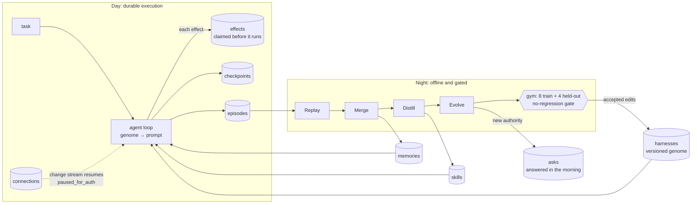

# Offload

**An agent harness that sleeps, and wakes up with a better harness.**

Offload learns the work you repeat, so next time you can hand it over. Its engine, **REM** (Replay · Evolve · Merge),
runs the harness on a day/night cycle:

- **Day.** The agent works long-horizon tasks through connected accounts, durably. Every step writes a checkpoint. Every
  side effect is claimed in an effects ledger before it runs, so a crash or an expired login never loses progress or
  sends the same email twice.
- **Night.** It replays the day, merges duplicate memories and forgets noise, distills repeated work into a tested skill,
  and evolves its own harness (rules, guardrails, tool scopes, context policy, model routing) against a gym with a
  held-out split. Every edit carries a falsifiable prediction, and a no-regression gate decides what ships.
- **Morning.** It asks once for any new authority it wants, such as letting a skill that sends email run on its own,
  then runs the same task again, measurably better.

Built for the MongoDB × Cerebral Valley **Harness Engineering & Model Wrangling** hackathon (NYC, September 26, 2026) for
both problem statements: recursive harnessing (the harness edits its own rules, guardrails, tool access and routing) and
long-horizon engineering (durable execution, plus memory that gets smaller and more precise as it grows, judged by hard
metrics).

## Sleep: measured context compaction (September 26, 2026)

Sleep now selects useful tool history with **Jev probabilities**, archives omitted records in **MongoDB**, and recovers
original evidence by run-scoped id. It preserves complete tool exchanges and detected constraints, reuses decisions
when the task state is unchanged, and removes identical read-only results without a model call. This is integrated
before planner/executor calls in the REM runtime and displayed under **Sleep > Context memory**.

**Live measured result: 44.15% fewer total tokens across repeated context, with the same 20/20 exact-answer
success rate.** Both paths used `openai/gpt-4o-mini`. Four synthetic task snapshots were each answered five times per
path. Totals include provider-reported input/output tokens and Jev's initial screening overhead; cached tokens are not
added twice. The compacted path used 14,878 tokens versus 26,640 for the full-context baseline.

| Task snapshot | Full-context tokens, 5 answers | Sleep tokens including Jev, 5 answers | Exact JSON checks |
| --- | ---: | ---: | --- |
| release | 6,650 | 3,767 | 5/5, both paths |
| meeting | 6,650 | 3,756 | 5/5, both paths |
| retry | 6,695 | 3,826 | 5/5, both paths |
| correction | 6,645 | 3,529 | 5/5, both paths |
| **Total** | **26,640** | **14,878** | **20/20, both paths** |

| Session/context check | Baseline or before | With this change | Measurement boundary |
| --- | --- | --- | --- |
| First answer, before reuse | 1,329 to 1,339 tokens | 3,157 to 3,414 tokens | **Compaction costs more initially**; reuse creates the measured savings |
| Required fact retention | Full history: 8/8; newest-three-record window: 0/8 | Jev selection: 8/8 | Four synthetic tasks; labels never sent to Jev |
| Selected record text | 7,219 to 7,235 characters | 149 to 165 characters | About 98% shorter record text, not a token-savings claim |
| Atlas selection latency | 4.45 to 8.22 seconds with sequential database operations | 0.96 to 1.82 seconds with batched writes | Observed runs; includes storage and Jev, not just inference |
| Repeated selection after restart | Initial selection needed 2 Jev calls per task | 0 new Jev calls for unchanged state | Durable decision reuse verified |
| Additional challenge answers | Full context: 4/4 | Selected context: 4/4 | Changed owner, cross-record reference, denied permission, exact artifact/hash |
| Automated checks | Existing suite plus new context checks | 97 passed, 1 Atlas smoke skipped; 4 browser checks passed | Local tests, desktop/mobile, production build passed |

**Limits:** these are repeated-snapshot microbenchmarks, not evolving multi-day tasks. Selection bounds active tool
history, while the existing checkpoint still stores the full canonical transcript. This does **not** establish
billion-token scalability or universal savings. Native Codex/OpenRouter chat and the separate chat-Sleep worktree are
not wired into this REM selector. This work does not expand Jev's separate, pre-existing completion gate.

Evidence and reproduction: [repeated live measurements](docs/evidence/jev-context-repeated.json),
[first-call overhead](docs/evidence/jev-context-atlas-paired.json),
[challenge measurements](docs/evidence/jev-context-challenge-verified.json), and
[architecture, research, commands and limitations](docs/sleep-context-compaction.md).

Enable with `REM_COMPACTION=jev`, a private Jev API key, and the intended Atlas environment. Run
`npm run context:benchmark` for labeled deterministic fixtures, or the documented `--live --atlas` commands for paid
live measurements. The implementation adapts state-aware compression principles from
[StateComp (September 2026)](https://arxiv.org/abs/2609.27298) and reversible, just-in-time memory ideas from
[Anthropic (September 2025)](https://www.anthropic.com/engineering/effective-context-engineering-for-ai-agents).

## See the cycle in one minute

Requires Node 22.12+ or 24.

```sh
npm ci
npm run rem:demo
```

This runs day one, the night, the morning and five simulated days in about a second, and rewrites
[docs/DEMO-NUMBERS.md](docs/DEMO-NUMBERS.md). The run is deterministic and ignores `.env`: an in-memory MongoDB
stand-in, a scripted model, a fixture Google workspace and a simulated reviewer (see [What is real](#what-is-real)).
Numbers from the current run:

| Metric | Day 1 | Day 5 |
| --- | --- | --- |
| Tasks passed | 2/4 | 4/4 |
| Collateral damage | 3 | 0 |
| Estimated cost for the day | $0.0861 | $0.0069 |
| Human interventions (corrections and reconnects) | 4 | 0 |
| Memories with sleep (raw items without) | 15 (30) | 32 (118) |
| Retrieval precision@k with sleep (without) | 1 (0.9) | 1 (0.4) |

Day one revokes the Drive token mid-run; days 2 to 5 inject a crash after the send instead. Costs count tokens as
characters/4 at placeholder prices.

- **Durability.** Day one's Drive token is revoked after step 3. The run parks as `paused_for_auth`, asks once, and a
  change stream on `connections` resumes it from its checkpoint after the reconnect. Over five days, 10 effects
  committed, 10 executed and 0 duplicated, and all 4 injected crashes were reconciled from the ledger.
- **Evolution.** Night one accepted two edits (a "never include customer names" rule and an internal-recipients-only
  guardrail) and rejected routing every executor call to the small model: it cut cost 82% but broke held-out task H2.
  The held-out split went from 1/4 at gen 0 to 3/4 after night one and 4/4 after night two. Train went from 3/8 to 8/8
  by harness v4. The proposer never sees held-out tasks; the gate does, so the split works as a validation set.
- **Morning.** Approving the ask ("Want me to send the brief myself next time?") makes the distilled weekly-brief skill
  autonomous. The same brief then takes 6 steps instead of 9 and $0.0321 instead of $0.0424, with no corrections. Day
  one's run also included the revoke and reconnect.

## How it works



**Day** (`rem/agent.js`, `rem/ledger.js`). The harness is data: a versioned genome of rules, guardrails, tool scopes, a
context policy and model routing. The agent builds its prompt from the genome plus retrieved memories and skills.
Guardrails are declarative predicates checked before every tool call. Each effect gets a key,
`sha256(runId, step, tool and arguments)`, inserted as `pending` under a unique index before the effect runs. A retry
that hits the key either returns the committed result or reconciles against the world without re-executing. The ledger
commit and the checkpoint update share one transaction. If the harness changed overnight, a resumed run re-plans its
remaining steps under the new version and keeps its committed effects.

**Night** (`rem/night.js`, `rem/evolve.js`, `rem/proposer.js`).
**Replay** re-reads the day's episodes.
**Merge** folds duplicate facts into memories with provenance, resolves contradictions by recency and confidence, drops
noise and sets consolidated episodes to expire through a TTL index.
**Distill** mines repeated tool-call sequences from runs and demonstrations into a parameterized skill and practices it
in a sandbox.
**Evolve** mines failure patterns on the train set, skips edits it has already tried, proposes up to three bounded
edits with predictions, validates each on train plus held-out, and commits only net-positive edits that break no
passing task. Prediction versus outcome is aggregated by edit type into a track record that calibrates the next
night's proposals. The proposer never sees held-out tasks, and the gym's fixtures and checkers are frozen.

**Morning** (`rem/asks.js`). Anything that needs new authority becomes an ask instead of passing the gate: a skill that
sends or deletes, a new tool scope, a loosened guardrail. Decisions are stored and shape later asks. After one read-only
approval, read-only skills are approved automatically; sends always ask.

The full design is in [docs/rem-engine.md](docs/rem-engine.md). The vocabulary is in [CONTEXT.md](CONTEXT.md).

## MongoDB

| Collection | Holds | MongoDB feature |
| --- | --- | --- |
| `effects` | effects ledger | unique `effectKey`: a retry hits error 11000 instead of a second send |
| `checkpoints` | per-run state | unique `runId`, one transaction with `effects` |
| `connections` | token state, granted scopes | change stream resumes paused runs |
| `episodes` | raw tool calls, observations, corrections, demonstrations | TTL on `expireAt` (forgetting); vector and text search on `summary` |
| `memories` | consolidated facts with provenance and contradiction links | vector + text, fused with `$rankFusion` or in the app |
| `skills` | procedures with a test, required scopes and approval status | unique `name`; vector + text |
| `harnesses` | immutable genome versions with parent, diff and fitness | lineage |
| `edits` | proposals, predictions, outcomes | hybrid search over past edits; the track record is an aggregation |
| `asks` | permission requests and decisions | unique `dedupeKey`, so a run asks once |
| `metrics` | per-day metrics | time-series collection |

`rem/db/schema.js` defines the indexes and the Atlas Vector Search and Atlas Search definitions (`autoEmbed` with
voyage-4). Change streams also feed `GET /api/rem/stream` over Server-Sent Events.

Two more MongoDB-backed services live under `server/`:

- **Durable harness** (`server/harness/`): a job queue with idempotent enqueue, atomic claims, renewable leases and
  fencing tokens, so a stale worker can't overwrite a newer one. Each run saves four checkpoints and receipts. It
  produces internal artifacts only; it sends nothing external.
- **Sleep v2** (`server/sleep/`): memories in Atlas Vector Search with Voyage embeddings, versioned harness policies,
  promotion only on held-out improvement with no regression, and a guarded rollback. Promotion is one compare-and-swap
  on the policy head. Tool-access requests are never promoted automatically.

## What is real

REM runs end to end without credentials, and the test suite covers REM, the durable harness and Sleep v2 without them.
Environment variables switch on the external services:

| Piece | Without credentials | With `.env` |
| --- | --- | --- |
| REM database | in-memory store with the Node driver's call shapes: unique indexes, TTL sweep, change streams, transactions | `MONGODB_URI` (Atlas Sandbox), optional `REM_DB_NAME` (default `rem`); gym and practice runs still use in-memory scratch databases |
| REM model | `ScriptedModel`: deterministic, follows the rules, guardrails, memories and skills in its prompt | `REM_MODEL=openrouter`, `OPENROUTER_API_KEY` |
| REM embeddings and search | local hashing embedder; app-side BM25 and cosine fused by reciprocal rank | `REM_EMBEDDINGS=voyage`, `VOYAGE_API_KEY`; `REM_ATLAS_SEARCH=1` for `$rankFusion` (MongoDB 8.1+) |
| REM proposer | a fixed catalog of 12 bounded edits, with predictions calibrated by the track record | an LLM proposer exists in `rem/proposer.js` but is not wired to an env switch |
| REM consolidator | a deterministic fact extractor over the fixture notes | not yet model-backed |
| Accounts and reviewer | a fixture Drive, Gmail and Calendar workspace with a deterministic revoke; day-one corrections come from the gym's checkers | no real OAuth yet |
| Durable harness | integration tests against a disposable local `mongod` | `MONGODB_URI`, `OPENROUTER_API_KEY`, `OFFLOAD_MODEL` |
| Sleep v2 | integration tests against a local `mongod`, with exact cosine in process instead of `$vectorSearch` | the harness variables plus `VOYAGE_API_KEY` |

Limits, stated plainly:

- The numbers above come from the scripted model, which responds to the catalog's rules by design, so the improvements
  are expected rather than discovered. The loop around it (mining, predictions, validation, the gate, the ledger) is
  real code. Running a real model through OpenRouter is what tests whether the edits help.
- Live runs against Atlas, OpenRouter and Voyage are not yet verified. `npm run rem:demo` always runs in memory; REM
  reaches Atlas only through the server and `/api/rem/*`.
- REM has no panel in the app yet. Its demo is the terminal story and the API.
- The Offload workspace in the app still runs on a deterministic mock engine (`shared/workspace.js`) in browser
  storage. The **Durable handoff** (`/app/harness`) and **Harness sleep** (`/app/adapt`) pages use the MongoDB-backed
  services.

## Run the app

```sh
npm run dev      # web on http://127.0.0.1:5193, API on 5194
```

`npm run dev` reads the local `.env` for the API. Existing browser workspaces stay local unless `VITE_STORAGE_MODE=api` is selected. For
the MongoDB-backed services, copy `.env.example` to `.env`, fill in the event Atlas Sandbox connection string and keys,
then:

```sh
npm run build
npm run harness:server   # site and API on http://127.0.0.1:5194
npm run harness:worker   # second terminal
npm run sleep:worker     # third terminal
```

Open http://127.0.0.1:5194/app/harness to create a durable handoff and http://127.0.0.1:5194/app/adapt to add
corrections and run a sleep review. With Sleep v2 configured, the server creates the `memory_vector` Atlas Vector Search
index on first start; wait until it is READY.

### REM API

| Route | Does |
| --- | --- |
| `GET /api/rem/state` | harness and lineage, edits, metrics, open asks, memory stats, skills, runs, effects ledger, latest brief |
| `POST /api/rem/run` | run a task (`{ taskId, week? }`) |
| `POST /api/rem/connection` | expire or restore a connection (`{ provider, state }`); restoring resumes paused runs |
| `POST /api/rem/sleep` | run one night and return the morning brief |
| `POST /api/rem/asks/:id` | approve or deny an ask |
| `POST /api/rem/simulate` | run simulated days (`{ days }`) |
| `POST /api/rem/reset` | start a fresh instance; on Atlas this drops the REM database |
| `GET /api/rem/stream` | Server-Sent Events from change streams |

The API is one shared demo instance with no authentication. The server listens on 127.0.0.1 only. Add authentication
before exposing it anywhere.

### ChatGPT on this Mac

Run `npm run dev`, open Connections, and choose **Use ChatGPT**. Offload reuses the Codex CLI sign-in on this computer. If needed, run `codex login` in Terminal first. Credentials stay in Codex. Set `OFFLOAD_CODEX_BIN` when the executable is elsewhere.

The composer lists models from Codex's `model/list`. GPT-5.5 has completed a live check on this machine. Other listed models can still be unavailable at execution time. Failed requests show an error and keep the conversation.

Chat uses the original Beautiful UI Prompt Bar, Streaming Text, Loading State and Context Cards. The sidebar uses its published Sidebar Nav. Offload sends its identity, up to four relevant notes of 360 characters each, and at most five earlier messages. Retrieval uses keyword matches with a small preference for saved rules. There is no embedding service. Codex adds its own system context, which appears in the token receipt.

The local bridge accepts only the loopback app origins and requires the app request header. It runs one model task at a time. Child runs use read-only permissions, an empty temporary folder, and disabled shell, app, plugin, hook, image, web and agent tools. It does not copy credentials into the browser. The bridge is disabled when `NODE_ENV=production`. This is a single-user local integration, not a public authentication service.

Overnight tasks save a brief, deadline and token target. They do not execute until an overnight worker is connected. Native chat context compaction and external app authorization remain separate work; the REM Sleep selector is documented above.

### Appearance and reasoning

Settings ends with 17 palettes, including monochrome, Codex-style light/dark, Claude-style light/dark and common editor palettes. System matching is available for the Codex and Claude families. Paste a `codex-theme-v1` export to import any other Codex palette. These are Offload adaptations, not a claim that every editor palette ships with the Codex desktop app. Fonts and layout stay consistent while the colors change.

The composer has Light, Medium, High, Extra high, Max and Ultra reasoning options. Levels not advertised for the selected model are disabled. The selected supported level is sent to Codex. Reduced-motion preferences remove the sliding animation.

## Tests

```sh
npm test          # 53 unit and integration tests
npm run test:e2e  # Playwright in Google Chrome, desktop and mobile; start npm run dev first
npm run build
```

`npm test` covers REM durability under seeded chaos (40 seeds × 4 tasks, crashes before and after each effect and
inside the commit, plus random auth expiries: every effect runs exactly once and every task finishes), the gym's
read-only boundary, the no-regression gate, Merge and Distill, asks and risk tolerance, and the durable harness and
Sleep v2 against a disposable local `mongod` (concurrent claims, stale-worker fencing, crash recovery, concurrent
promotions, rollback).

## Desktop and deployment

```sh
npm run desktop:setup
npm run desktop
npm run desktop:package
```

The Electron wrapper disables Node integration and remote pages, and enables context isolation and the sandbox.
Packaging is unsigned. `npm run build` produces `dist/`, which deploys to Vercel as a static site with `vercel.json`;
keep `VITE_STORAGE_MODE=browser` for a public demo, since the static site does not include the API.

## Layout

| Path | What |
| --- | --- |
| `rem/` | REM engine: day loop, ledger, night, evolution, gym, asks, database adapters |
| `server/index.js` | Express API: workspace, durable harness, Sleep v2, and REM (`server/rem.js`) |
| `server/harness/`, `server/sleep/` | durable harness and Sleep v2 |
| `src/` | React 19 + Vite app and landing site |
| `shared/workspace.js` | the mock engine behind the Offload workspace |
| `scripts/rem-demo.mjs` | the terminal demo |
| `desktop/` | Electron wrapper |
| `.mcp.json`, `scripts/mongodb-mcp.mjs` | a MongoDB MCP server for Claude Code sessions, read-only on the same `MONGODB_URI` |
| `tests/` | `node:test` suites and Playwright specs |
| `docs/` | concept, engine design, demo numbers, build plan |

More: [docs/03-rem-concept.md](docs/03-rem-concept.md) (the concept),
[HARNESS_HANDOFF.md](HARNESS_HANDOFF.md) and [SLEEP_HANDOFF.md](SLEEP_HANDOFF.md) (the MongoDB services),
[THIRD_PARTY.md](THIRD_PARTY.md) (component provenance and licenses).

## Prior art

REM stands on Letta's sleep-time compute (agents reorganize memory while idle), Self-Harness and Agentic Harness
Engineering (weakness mining, proposals with predictions, held-out validation), and durable execution from Temporal
and Restate. What REM adds is one cycle in which consolidation, skill distillation and harness evolution are validated
against hard metrics, and in which a paused task resumes under the new harness version without repeating an effect.

## Team

Tensae Laki (lead), Floyd Korzan (app and design), Ryan (durable harness and Sleep v2).


## Local agent and capture update

## ChatGPT on this Mac

Run `npm run dev`, open Connections, and choose **Use ChatGPT**. Offload reuses the Codex CLI sign-in on this computer. If needed, run `codex login` in Terminal first. Credentials stay in Codex. Set `OFFLOAD_CODEX_BIN` when the executable is elsewhere.

The composer lists models from Codex's `model/list`. GPT-5.5 has completed a live check on this machine. Other listed models can still be unavailable at execution time. Failed requests show an error and keep the conversation.

Chat uses the original Beautiful UI Prompt Bar, Streaming Text, Loading State and Context Cards. The sidebar uses its published Sidebar Nav. Offload sends its identity, up to four relevant notes of 360 characters each, and bounded recent conversation history. Retrieval uses keyword matches with a small preference for saved rules. There is no embedding service. Codex adds its own system context, which appears in the token receipt.

The local bridge accepts only the loopback app origins and requires the app request header. It runs one model task at a time. Codex runs use App Server with persistent conversation threads, image input, workspace-write permissions, live tool activity, and approval prompts. Each chat has its own working folder under `~/.offload/workspaces`, unless a project folder is selected in Settings. Installed tools depend on the local Codex configuration and account. Additional permissions are requested for the current turn; inherited automatic app/tool approval settings are overridden. Stopping a run terminates its process group. Generated files are snapshotted for download; HTML and SVG files are never embedded as active content. It does not copy credentials into the browser. The bridge is disabled when `NODE_ENV=production`. This is a single-user local integration, not a public authentication service.

Overnight tasks save a brief, deadline and token target. They do not execute until an overnight worker is connected. Native chat context compaction and external app authorization remain separate work; the REM Sleep selector is documented above. The desktop package must be rebuilt separately; this change is running in the local browser app. No public deployment was made. Code is on the MyName branch of SpectrrT/MongoDB_HarnessHack.

## Appearance and reasoning

Settings ends with 17 palettes, including monochrome, Codex-style light/dark, Claude-style light/dark and common editor palettes. System matching is available for the Codex and Claude families. Paste a `codex-theme-v1` export to import any other Codex palette. These are Offload adaptations, not a claim that every editor palette ships with the Codex desktop app. Fonts and layout stay consistent while the colors change.

The composer has Light, Medium, High, Extra high, Max and Ultra reasoning options. Only levels advertised for the selected model appear. The selected supported level is sent to Codex. Reduced-motion preferences remove the sliding animation.


## OpenRouter

Connections includes an OpenRouter authorization flow with PKCE. Sign in, set a credit limit in OpenRouter, and approve the local callback. Offload stores the resulting key in a private, ignored `.data/openrouter/` file with owner-only permissions. It never returns the key to the browser or includes it in workspace exports. Choose **Use OpenRouter** after authorization to switch providers. Disconnect removes the local key; revoke it in OpenRouter to invalidate it everywhere.

The model picker loads OpenRouter's current text model catalog and includes search. Responses have an 8,192-token output cap. Tool-capable models can list/read local files and request approval to write files or run commands, for up to 40 steps per turn. Vision-capable models accept attached images. Image-output models can return generated images. OpenRouter does not inherit Codex-specific tools or plugins. The reasoning slider sends the provider's low, medium or high setting when the model supports reasoning; models without reasoning support disable the slider. Codex models keep their own advertised effort levels. Keys are tied to this browser's local session. Do not expose the local server publicly.

## Local HTTPS address

See [Local HTTPS setup](docs/LOCAL-HTTPS.md) for https://offload.ai on this Mac. No public domain or DNS changes are needed.


## Work session capture

Screen records the chosen display, window or tab. Microphone records the selected audio input. Both records those video and microphone tracks into one file. Browser permissions are required. Closing the session panel or changing workspace pages does not stop capture. Stop session, the browser's Stop sharing control, or closing the app tab stops it. Reloading ends the recording; it never silently restarts.

Recording chunks are saved in this browser's IndexedDB as they arrive. Reopen the session panel to download recent recordings. Audio is recorded locally; automatic transcription is not included. While screen capture is active in the same tab, messages to an image-capable model include the current screen image (when an image slot is free). This is on-demand context, not continuous model analysis.
